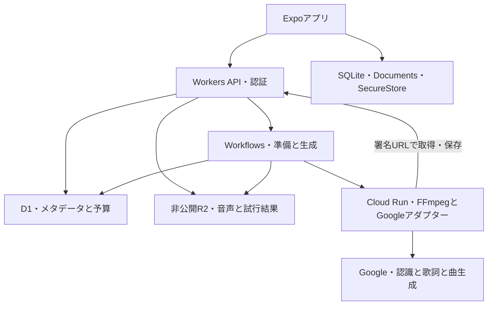
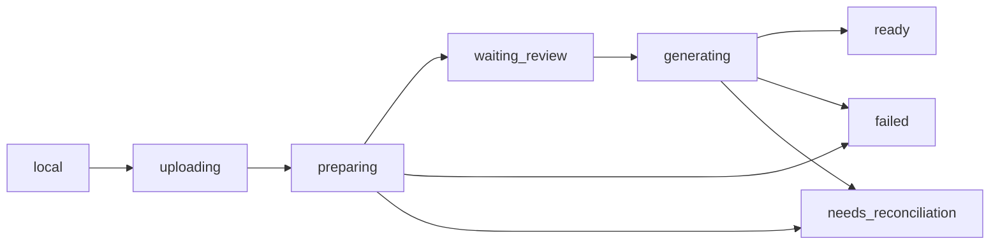

# 構成・設計

[ドキュメントの目次](README.md)へ

現在の実装はExpo / React Nativeアプリと、Cloudflare Workers・D1・非公開R2・Workflows、Google Cloud Runの音声処理サービスで構成します。採用理由は[ADR 0011](adr/0011-cloudflare-free-audio-runtime.md)、配置情報と確認状況は[検証記録](audio-pipeline-verification.md#現在の確認状況)を参照してください。

## 全体構成

| 部分 | 責務 | 実装の入口 |
| :--- | :--- | :--- |
| Expoアプリ | 録音、取り込み、下書き保存、歌詞編集、状態取得、再生 | [セッション操作](../src/useSession.ts) |
| 端末内保存 | UIDごとのDocumentsに音声、UIDごとのSQLiteに状態。認証セッションはFirebase SDK | [保存](../src/platform/storage.native.ts) |
| Workers API | 認証、所有者確認、multipart、ジョブ受付、署名URL、内部callback | [API](../backend/api.ts) |
| D1 | 下書き、発話、歌詞版、ジョブ、有料試行、話者名・登録状態・所有者付き声特徴 | [初期スキーマ](../backend/migrations/0001_initial.sql)・[実行権の追加](../backend/migrations/0002_audio_runtime.sql)・[話者登録](../backend/migrations/0003_speaker_profiles.sql) |
| R2 | 元音声、分割音声、生成MP3、生応答、回復用結果、非公開の登録音声 | [音声API](../backend/media-api.ts)・[callback](../backend/runtime-api.ts)・[話者API](../backend/speakers.ts) |
| Workflows | 準備と曲生成を別ジョブとして進める | [Workflows](../backend/workflows.ts) |
| Cloud Run | 実時間検査、変換、分割、Google応答処理、音声の取得・保存 | [音声サービス](../backend/media/server.mjs)・[プロバイダー処理](../backend/media/providers.mjs) |
| Google API | 文字起こし・歌詞案・音楽生成 | [Googleアダプター](../pipeline/google.ts) |

## 音声から曲までのデータの流れ

1. 端末で録音・取り込みを行い、音声と下書きを先に保存する。
2. Workersへ下書きと音声を送る。音声は8MiB単位のmultipartでR2へ保存する。
3. 準備WorkflowがCloud Runへ元音声の署名URLと分割音声の保存URLを渡す。
4. Cloud RunがFFmpeg / ffprobeで実時間・形式を検査し、モノラル16kHz・AACへ変換して25分単位に分割する。区間のoffsetを保持してR2へ保存する。
5. WorkflowがD1で予算を予約し、Cloud Runが分割音声をGoogleへ送る。元音声内の時刻を持つ発話をD1へ保存し、元発話IDを持つ歌詞案を作る。
6. 文字起こしを保存した後、ジョブ開始時に固定した話者プロフィールでチャンク内の非重複発話を照合する。一致が曖昧な仮話者は元ラベルのまま残し、識別名はD1と歌詞作成へ渡す。
7. アプリで歌詞を確認・編集し、リビジョンを確定する。
8. 生成Workflowがそのリビジョンから曲を生成する。Cloud RunがMP3・生応答・回復用結果をR2へ保存する。Workflowが歌詞照合・実時間検査を行い、完成曲を登録する。
9. アプリがジョブと曲を取得し、期限付きURLで曲と元会話を再生する。

大きなGoogle応答のJSON解析・Base64復号と音源の展開はCloud Runで行います。Workerに返すのは発話・歌詞・音源メタデータ・料金です。長い発話一覧の検証や保存はWorker側に残るため、無料枠への適合は[実測の範囲](audio-pipeline-verification.md#実クラウドへの配置と接続確認)と区別します。

## 主要データの契約

正式な型と定数は[共有契約](../shared/contracts.ts)を参照してください。

| データ | 主な関係・意味 |
| :--- | :--- |
| AudioClip / LocalClip | 下書きに属する音声。録音日時・取り込み日時・タイムゾーン・場所を保持。端末側はURIと送信進行も保持 |
| Utterance | 音声ID、仮の話者、元ファイル内の開始・終了時刻、文字起こし |
| SpeakerProfile | 所有者付きの名前、サーバー登録状態、モデル版。端末側は登録音声のDocuments参照を保持 |
| LyricBlock / LyricRevision | 歌詞ブロックと元発話ID、編集ごとに増えるリビジョン |
| DraftDocument / LocalDraft | 下書き、音声一覧、発話、歌詞、状態、ジョブID。端末側は冪等キーも保持 |
| JobDocument | 準備または生成の種類、状態、処理段階、エラー、完成曲ID |
| SongDocument | 完成曲、生成に使った歌詞版、元音声と発話、生成音源ID・実時間 |
| LibraryDocument | 端末の下書き・曲・録音中メタデータ・復旧対象 |

歌詞編集は現在のリビジョンを指定し、競合する旧版を拒否します。生成は確認済みリビジョンと内容の指紋を固定します。同じ冪等キーと同じ内容の受付は同じジョブを返し、内容が異なれば競合として拒否します。[クライアント](../src/pipeline/api.ts)と[API実装](../backend/api.ts)が具体的な入出力を持ちます。

## 下書きとジョブの状態

| 状態 | 扱い |
| :--- | :--- |
| local | 端末内の録音・取り込み・下書き編集 |
| uploading | 元音声を送信中。進行を保存 |
| preparing | サーバーで音声検査・文字起こし・歌詞案作成 |
| waiting_review | 歌詞の確認・編集が必要 |
| generating | 確認済み歌詞版から曲を生成中 |
| ready | 完成曲を取得できる |
| failed | 処理が停止。エラーと保存された音声・結果を確認 |
| needs_reconciliation | 有料処理の成否が不明。予約を保持して照合を待つ |

ジョブは受付時に `queued`、実行時に `running` となり、処理段階を `stage` で示します。再起動時は端末のジョブID・冪等キーから状態を取得します。録音中の表示はそのまま復元せず、実ファイルを検査します。[状態統合](../src/pipeline/library.ts)・[録音と再生](../src/platform/useAudioEngine.native.ts)も参照してください。

## 認証と保存先

- アプリのFirebase IDトークンをWorkerが署名・発行元・対象プロジェクト・期限・Googleプロバイダーで検証する。検証済みメールの許可リストを確認し、UIDを所有者にする。
- API URLとFirebase非秘密設定はビルド時に固定する。トークン更新はFirebase SDKが行い、認証更新を理由に有料POSTを再送しない。Google AIキーは端末に置かない。
- R2の公開URLは無効。音声取得・Range再生は所有者を確認した署名URLを使う。再生URLの標準期限は5分。
- WorkerからCloud Runの処理ルートへは別のBearerトークンで認証する。公開 `/health` は `ok` だけを返す。
- 内部URLはHTTPメソッド・用途・期限・ジョブ・所有者・試行を検証する。処理用URLは最大1時間。
- Cloud RunのGoogleキーはサービス設定に置き、専用実行アカウントにはGoogle Cloudリソースの管理権限を付与しない。

具体的な設定場所は[接続設定の一覧](audio-pipeline-setup.md#接続設定の一覧)、署名の実装は[security.ts](../backend/security.ts)を参照してください。

## 有料試行と結果回復

[ADR 0010](adr/0010-google-audio-quality-trial.md)に従い、AI検証は累積10ドル以内で管理します。ローカルPoCからは実績・未確定予約を差し引いた残額だけを移し、ローカル側の新規有料処理を閉じます。予算の初期化や複数環境への同じ残額の割り当ては行いません。

Workflowは外部呼び出し前にD1へ試行と予約額を保存します。Cloud Runは署名claim URLで `runtime_claimed_at` を一度だけ取得してからGoogleを呼びます。これは同じ試行の重複実行を防ぐためのD1による排他制御です。

費用と未確定予約は全利用者共通の `budget_ledger` で累積管理する。`0004` は既存試行を複写し、個人に紐づく `provider_attempts` の削除後も金額・状態を残す。

MP3、生応答の `.raw.json`、小さい回復用 `.json` をR2へ保存してからCloud Runが応答します。応答喪失後は保存結果を読み、予算を精算して再利用します。結果がない送信済み試行は `needs_reconciliation` で予約を保持し、有料POSTを自動再送しません。入力拒否を確認できた試行は予約を解放し、予約超過の料金見積もりでは新規呼び出しを止めます。

これはアプリ側の予算制御で、プロバイダー請求の厳密な上限保証ではありません。基盤費用は別に扱います。[予算実装](../backend/paid.ts)・[ローカル台帳](../pipeline/budget.ts)・[運用手順](audio-pipeline-setup.md#障害と結果不明の確認)を参照してください。

## 関連資料

- [プロダクト仕様](product-spec.md)
- [設定・デプロイ・運用](audio-pipeline-setup.md)
- [内部テスト](internal-testing.md)
- [現行構成のADR](adr/0011-cloudflare-free-audio-runtime.md)・[ADR一覧](adr/README.md)

## 本人データの削除

削除APIがアカウントをdeletingにして処理を遮断し、専用 `DeleteAccountWorkflow` が既存Workflow状態・Firebase・D1・R2を削除する。受け付けた要求と途中失敗を同じWorkflowで再開する。署名URLとコールバックはDBリソースから所有者を解決し、ジョブ・クリップ・試行を照合する。削除中に完了したR2書き込みも削除する。拒否記録は24時間、独立費用台帳は継続保持する。[配布・削除運用](play-internal-release.md)と[ADR 0014](adr/0014-firebase-account-isolation.md)を参照する。
